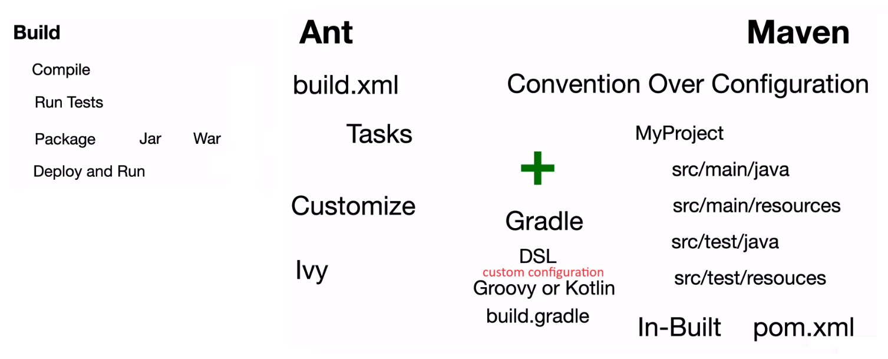
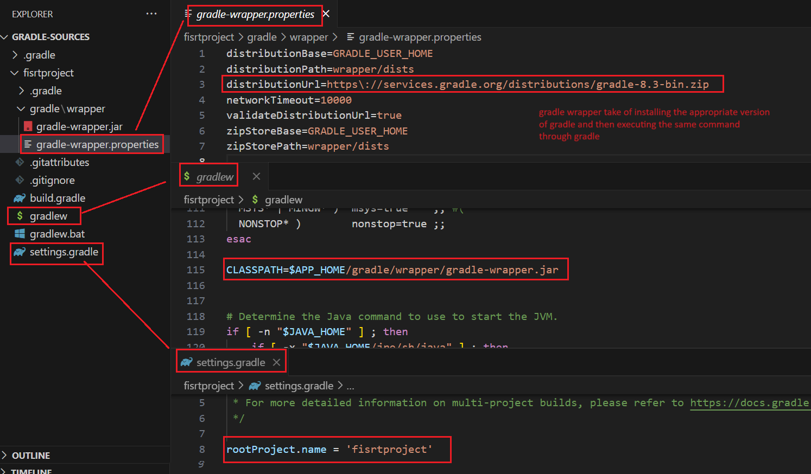
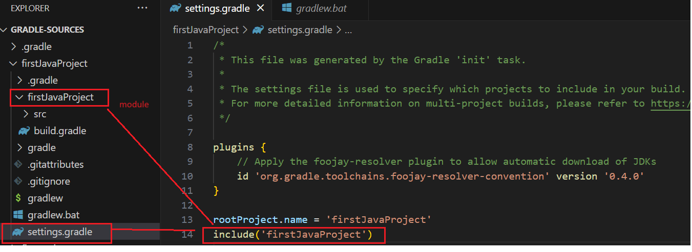
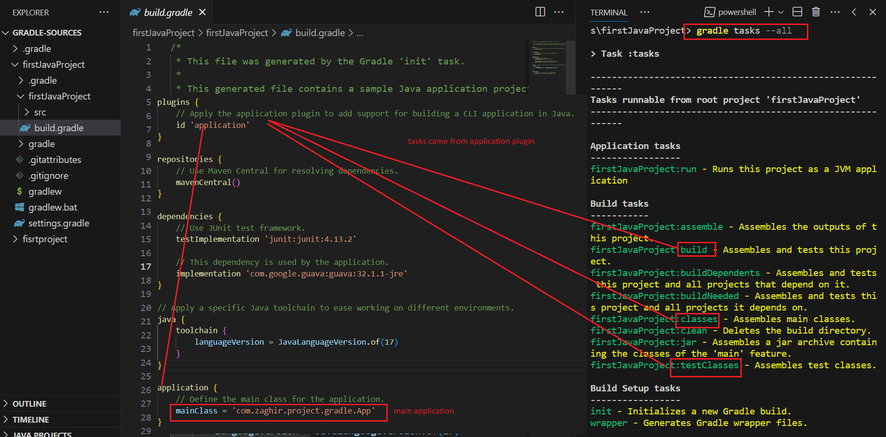
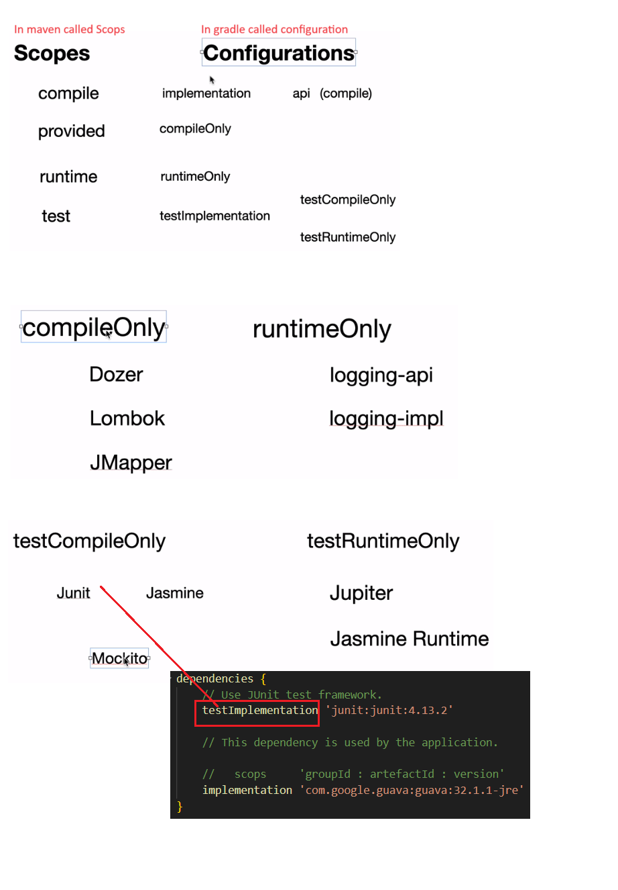
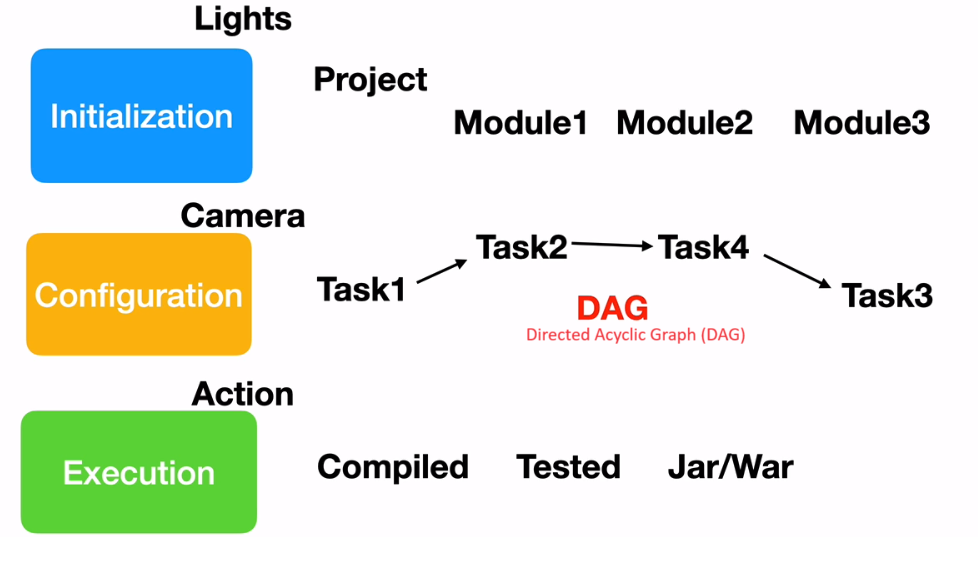
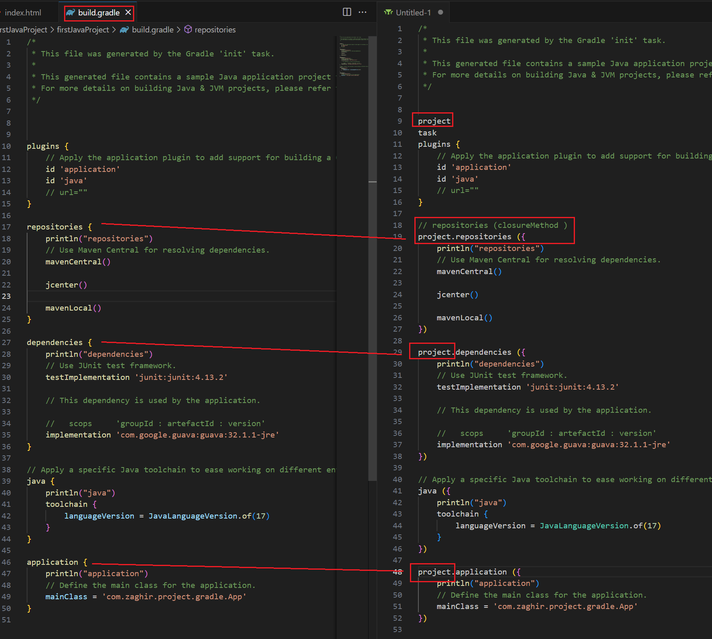

 # What is Gradle
 
 
 
 
 #installation 
 https://docs.gradle.org/current/userguide/installation.html
 https://docs.gradle.org/current/userguide/installation.html#windows_installation
 
````
export GRADLE_HOME=/usr/local/gradle/gradle-8.3
export PATH=$GRADLE_HOME/bin:$PATH
````
````
gradle -v
````
  
https://docs.gradle.org/current/userguide/tutorial_using_tasks.html


# create projet 

create folder gradlesource/firstprojet
````
cd firstprojet

gradle init
Starting a Gradle Daemon (subsequent builds will be faster)

Select type of project to generate:
  1: basic
  2: application
  3: library
  4: Gradle plugin
Enter selection (default: basic) [1..4] 1

Select build script DSL:
  1: Kotlin
  2: Groovy
Enter selection (default: Kotlin) [1..2] 2

Project name (default: fisrtproject):
Generate build using new APIs and behavior (some features may change in the next minor release)? (default: no) [yes, no]


> Task :init
To learn more about Gradle by exploring our Samples at https://docs.gradle.org/8.3/samples

BUILD SUCCESSFUL in 1m 45s
2 actionable tasks: 2 executed


clear 

gradle tasks 
gradle tasks --all

````

- execute task 
````
gradle firstTask          it s the same   => gradle fT
````





## Create first java project 

create folder 
````
mkdir firstJavaProject 
cd firstJavaProject 
Select type of project to generate:
  1: basic
  2: application
  3: library
  4: Gradle plugin
Enter selection (default: basic) [1..4] 2

Select implementation language:
  1: C++
  2: Groovy
  3: Java
  4: Kotlin
  5: Scala
  6: Swift
Enter selection (default: Java) [1..6] 3

Generate multiple subprojects for application? (default: no) [yes, no] no
Select build script DSL:
  1: Kotlin
  2: Groovy
Enter selection (default: Kotlin) [1..2] 2

Select test framework:
  1: JUnit 4
  2: TestNG
  3: Spock
  4: JUnit Jupiter
Enter selection (default: JUnit Jupiter) [1..4] 1

Project name (default: firstJavaProject):
Source package (default: firstjavaproject): com.zaghir.project.gradle
Enter target version of Java (min. 7) (default: 20): 17
Generate build using new APIs and behavior (some features may change in the next minor release)? (default: no) [yes, no] no

`````



`````
 gradle tasks --all
 `````




`````
create build folder 

 gradle compileJava
 
 clean build 
 
 gradle clean
 
 gradle test
 
 gradle jar 
 
 gradle run 
 
 `````
 
## Configuration



## Build phase



- build project in daemon mode 

````
gradle build --daemon
gradle build --no-daemon
````

## Data Type 

create script  DataType.groovy
````

package com.zaghir.project.groovy

def a = 1

def b = 1.25F

float c = 2

d = 'hello '
println("a : "+ a+" ==>  "+a.class)
println("b : "+ b+" ==>  "+b.class)
println("c : "+ c+" ==>  "+c.class)
println("d : "+ d+" ==>  "+d.class)

d = "hello ${c}"
println("d : "+ d+" ==>  "+d.class)

e = '''
Write all you need 
you dont have to add \n
'''
println("e : "+ e)

//emailRegularExpression = //
emailRegularExpression = /^([a-zA-Z0-9_\-\.]+)@([a-zA-Z0-9_\-\.]+)\.([a-zA-Z]{2,5})$/
println("emailRegularExpression : "+ emailRegularExpression+" ==>  "+emailRegularExpression.getClass())
println "test@gmail.com" ==~ emailRegularExpression

````

## Closures  == expression lambda in java 

create script  ClosuresDemo.groovy
````
package com.zaghir.project.groovy

c = {
    println("Closures are super simple")
}
// call an execute
c.call()

//  clusore with param
d = { n ->
    println(n % 2 == 0 ? "even" : "odd")
}
d.call(10)

//
4.times {
    n -> print n
}

4.times {
    println it  // it = iterator
}

````

## Collection Type
````
package com.zaghir.project.groovy

 l = [1 , 2 , 3]
println l
println l.getClass()
println "-------------------------------"
LinkedList ll =  [1 , 2 , 3]
println ll
println ll.class
println "-------------------------------"
l << 4
println l
println "-------------------------------"
l = l + [4 , 5 , 6]
println l
println "-------------------------------"
l = l - [2 ,5]
println l
println "-------------------------------"

l.each { println(it)}
println "-------------------------------"
l.reverseEach { println( it)}
println "-------------------------------"
l.eachPermutation { println( it)}
println "-------------------------------"

````

## Set and Map 

````
package com.zaghir.project.groovy
//----------------Set
s = ['java' ,'rust' , 'groovy' , 'typescript', 'python' ,'python'] as Set
// size = 5 != 6  , not accept duplicate value python
println s.size()
println s
println s.class

//----------------TreeSet
ts = ['java' ,'rust' , 'groovy' , 'typescript', 'python' ,'python'] as Set
// size = 5 != 6  , not accept duplicate value python
println ts.size()
println ts
println ts.class

//----------------Map
m = [:]
println m

n = [couseName : 'Gradle' , racing: 5 , price: 20]
println n
n.each { k,v ->
    println(" key: ${k} , value : ${v} " )
}

println n.couseName
println n['couseName']
println n.get('couseName')

n.review = 'Its great'
println n.get('review')

n['review'] = 'Its great 2'

````

## Method 

````
package com.zaghir.project.groovy

// def product( x , y ){
int product( int x , int y ){
   x*y
}

result = product  2 , 3
println result

int productDefaultvalue( int x = 1, int y ){
    x*y
}

result = productDefaultvalue   3
println result

void display (Map productionDetails){
    println "name : ${productionDetails.name} , price: ${productionDetails.price}"

}
display([name: "Raspbery3" , price: 50.0])
display(price: 25.0 , name: "Orangebery3")


````

## Classes and objects 


create file ClassesDemo.groovy
````
package com.zaghir.project.groovy


class Patient {
    def firstName , lastName , age
    static hospitalCode = "Best Hospital"

    void setLastName(lastName) {
        if (lastName == null) {
            throw new IllegalArgumentException("Last name can not be null ")
        }
        this .lastName = lastName
    }
    static void display(){
        println hospitalCode
    }
}

p = new Patient(firstName: "zaghir", lastName: "you" , age: 40)
p.setLastName("p")
println( p.firstName + p.lastName + p.age)

Patient.display()

````

# Build.gradle
## Project Object 



run 
````
gradle build 
````


## Project properties

in build.gradle file 

````
plugins {
    // Apply the application plugin to add support for building a CLI application in Java.
    id 'application'
    id 'java'
    // url=""
}

project.description="First Java project"
project.version=1.0

repositories {
    
    println project.name
    println project.description
    println project.version
    println project.group
    println project.path
    println project.buildDir
    println project.projectDir

    println("repositories")
    // Use Maven Central for resolving dependencies.
    mavenCentral()

    jcenter()

    mavenLocal()
}

dependencies {
    println("dependencies")
    // Use JUnit test framework.
    testImplementation 'junit:junit:4.13.2'

    // This dependency is used by the application.
    
    //   scops     'groupId : artefactId : version'
    implementation 'com.google.guava:guava:32.1.1-jre'
}

// Apply a specific Java toolchain to ease working on different environments.
java {
    println("java")
    toolchain {
        languageVersion = JavaLanguageVersion.of(17)
    }
}

application {
    println("application")
    // Define the main class for the application.
    mainClass = 'com.zaghir.project.gradle.App'
}

````

run command 
````
gradle clean build
````

## Adding customer properties 

in build.gradle file 
````
plugins {
    // Apply the application plugin to add support for building a CLI application in Java.
    id 'application'
    id 'java'
    // url=""
}

project.description="First Java project"
project.version=1.0

// custom properties
project.ext.props1="1111"
project.ext.props2="2222"

repositories {
    
    println project.name
    println project.description
    println project.version
    println project.group
    println project.path
    println project.buildDir
    println project.projectDir
    println project.property("props1")
    println project.property("props2")


    println("repositories")
    // Use Maven Central for resolving dependencies.
    mavenCentral()

    jcenter()

    mavenLocal()
}

dependencies {
    println("dependencies")
    // Use JUnit test framework.
    testImplementation 'junit:junit:4.13.2'

    // This dependency is used by the application.
    
    //   scops     'groupId : artefactId : version'
    implementation 'com.google.guava:guava:32.1.1-jre'
}

// Apply a specific Java toolchain to ease working on different environments.
java {
    println("java")
    toolchain {
        languageVersion = JavaLanguageVersion.of(17)
    }
}

application {
    println("application")
    // Define the main class for the application.
    mainClass = 'com.zaghir.project.gradle.App'
}
````
run command 
````
gradle clean build
````

## Task object 

````
gradle tasks
````

in build.gradle file 

````
// when we execute this command 
// gradle compile 
// 
// gradle create task like that 
// Task task = new compile
// project.addTask (task)


plugins {
    // Apply the application plugin to add support for building a CLI application in Java.
    id 'application'
    id 'java'
    // url=""
}

````
## Task variables and methods 

edit firstproject/build.gradle
````
task (firstTask) {
    def abc = 123
    println abc 
    println 'Gradle firstTask'
}

task deployToStage {    
    doLast(){
        println 'Deploy to stage'
    }    
}

task deployToProd {
    doLast(){
        println 'Deploy to prod'
    }    
}

task cleaupFiles {
    doLast(){
        println 'Cleanup Files'
    }    
}

deployToProd.dependsOn(deployToStage)
deployToProd.finalizedBy cleaupFiles

defaultTasks = ["deployToStage"]

````

run code 
````
gradle deployToProd

or default 

gradle  

````

> Configure project :
123
Gradle firstTask

> Task :deployToStage
Deploy to stage

> Task :deployToProd
Deploy to prod

> Task :cleaupFiles
Cleanup Files

# Create a java web application 

create firstWebApp 
cd firstWebApp  
gradle init 

````
gradle tasks --all 

firsWebApplication:war 
````
gradle appRun 

see firstWebApp 


# Multi module Projets 

````
mkdir couponapp
cd couponapp

gradle init
Select type of project to generate:
  1: basic
  2: application
  3: library
  4: Gradle plugin
Enter selection (default: basic) [1..4] 2

Select implementation language:
  1: C++
  2: Groovy
  3: Java
  4: Kotlin
  5: Scala
  6: Swift
Enter selection (default: Java) [1..6] 3

Generate multiple subprojects for application? (default: no) [yes, no]
Select build script DSL:
  1: Kotlin
  2: Groovy
Enter selection (default: Kotlin) [1..2] 2

Select test framework:
  1: JUnit 4
  2: TestNG
  3: Spock
  4: JUnit Jupiter
Enter selection (default: JUnit Jupiter) [1..4] 1

Project name (default: couponapp):
Source package (default: couponapp): com.zaghir.project.gradle
Enter target version of Java (min. 7) (default: 20):
Generate build using new APIs and behavior (some features may change in the next minor release)? (default: no) [yes, no]

````

settings.gradle
````
 * This file was generated by the Gradle 'init' task.
 *
 * The settings file is used to specify which projects to include in your build.
 * For more detailed information on multi-project builds, please refer to https://docs.gradle.org/8.3/userguide/building_swift_projects.html in the Gradle documentation.
 */

plugins {
    // Apply the foojay-resolver plugin to allow automatic download of JDKs
    id 'org.gradle.toolchains.foojay-resolver-convention' version '0.4.0'
}

rootProject.name = 'couponapp'
include('web')
include('services')
include('data')
include('integration')

````

gradle build
gradle clean 


run task in the specific module 
````
couponapp>gradle :web:clean

````

create task for all module 
create build.gradle add   
````
allprojects({
    task printProjectName {
        doLast(){
            println project.name
        }
    } 
})


subprojects({
    task printSubProjectName {
        doLast(){
            println project.name
        }
    } 
})
````

run task printProjectName  for module 
````
gradle :web:printProjectName
gradle :services:printProjectName
gradle :data:printProjectName
````

````

gradle printProjectName          also for the root project 
 
> Task :printProjectName         root project       
couponapp

> Task :data:printProjectName
data

> Task :integration:printProjectName
integration

> Task :services:printProjectName
services

> Task :web:printProjectName
web
````

````

gradle printSubProjectName               not for the root project 

> Task :data:printSubProjectName
data

> Task :integration:printSubProjectName
integration

> Task :services:printSubProjectName
services

> Task :web:printSubProjectName
web

````


## Reuse Build Logic 


clean file couponapp/services/build.gradle
clean file couponapp/data/build.gradle
clean file couponapp/integration/build.gradle

in couponapp/build.gradle add this 

````
allprojects({
    task printProjectName {
        doLast(){
            println project.name
        }
    } 
})


subprojects({
    
    version = '1.0'
    group = 'com.zaghir.project.gradle'

    apply plugin : 'application'

    repositories {
        mavenCentral()
    }

    dependencies {
        testImplementation 'junit:junit:4.13.2'
    }

    task printSubProjectName {
        doLast(){
            println project.name
        }
    } 

})

// add dependendies  services to web 
project(':web'){
    dependencies {
        implementation project(':services')
    }
}

project(':services'){
    dependencies {
        implementation project(':data')
    }
}

project(':data'){
    dependencies {
        implementation project(':integration')
    }
}

````


build specific module 
````
gradle :web:clean :web:build

````

## show dependencies  

````
cd  couponapp
gradle web:dependencies
gradle services:dependencies

````

gradle clean build 
gradle :web:clean :web:build


